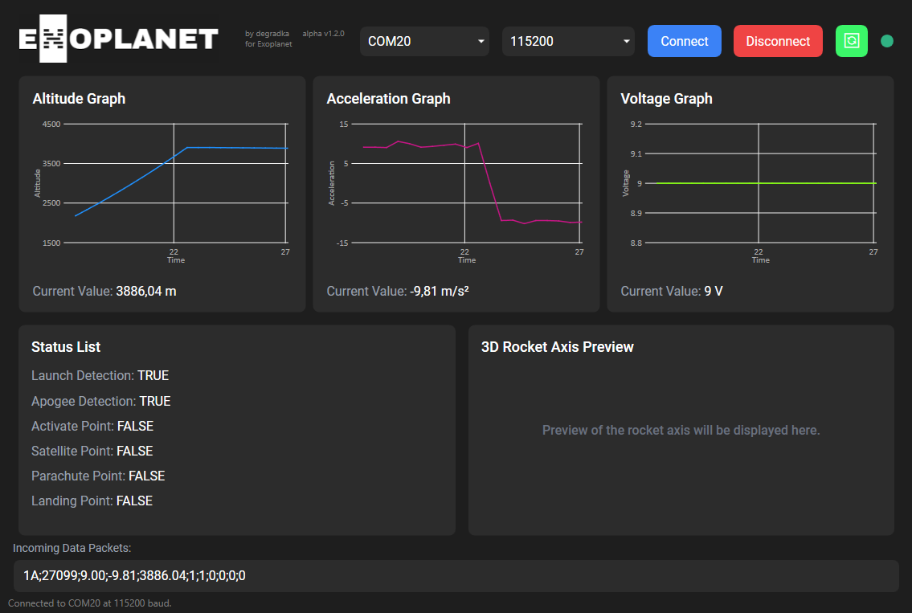

# ExoplanetDashboard

### What is this?
The Exoplanet Dashboard is a custom-built program designed to connect to an Arduino-based radio station via a COM port, receiving and visualizing data packets captured from a rocket. The program is specifically tailored for our team's use in the rocket championship, as the data format adheres to the championship guidelines.

### What does it do?

* Connects to Arduino-based radio station via COM port
* Receives raw data packets from the rocket
* Visualizes data in easy-to-understand graphs and lists for real-time monitoring
* Automatically saves all logs for future reference

### Customization
Although designed for our team's specific needs, no one stops you from forking and modifying to accommodate different data formats and requirements. Feel free to adapt the code to suit your project's needs.

### Current Status
**HEAVILY WIP** (Work In Progress)

If you are connected to the port and click disconnect, program crashes but logs are still saved.

### Acknowledgments
Special thanks to our team members for their contributions to this project.

### License
This project is licensed under the [MIT License](LICENSE.txt)
